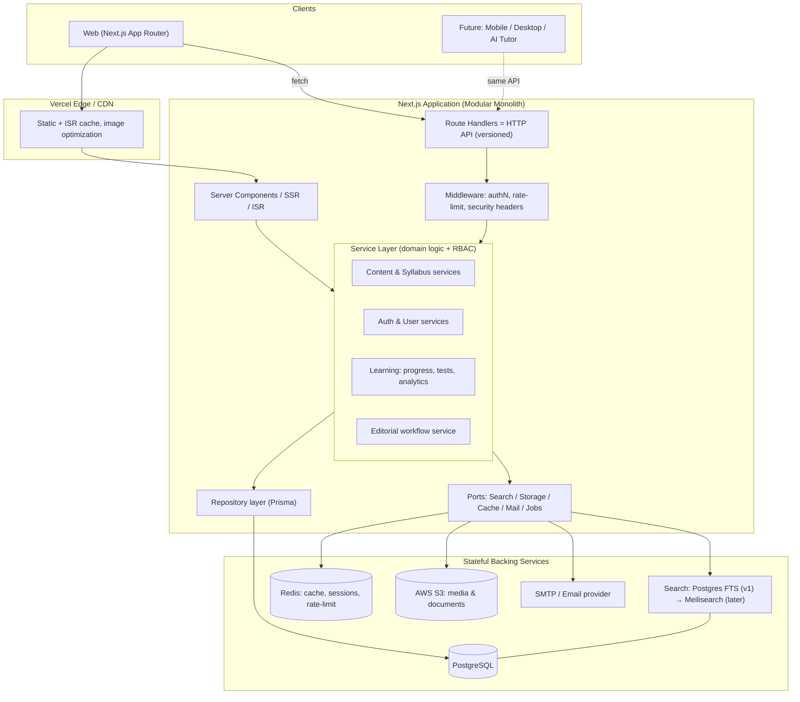
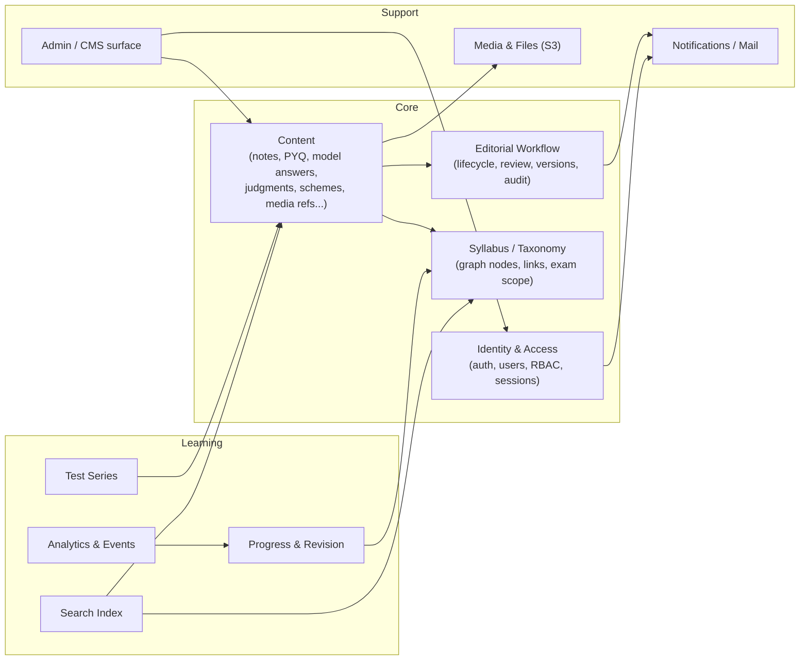
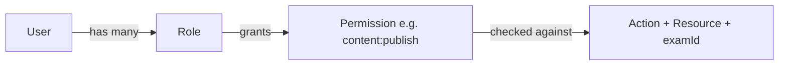
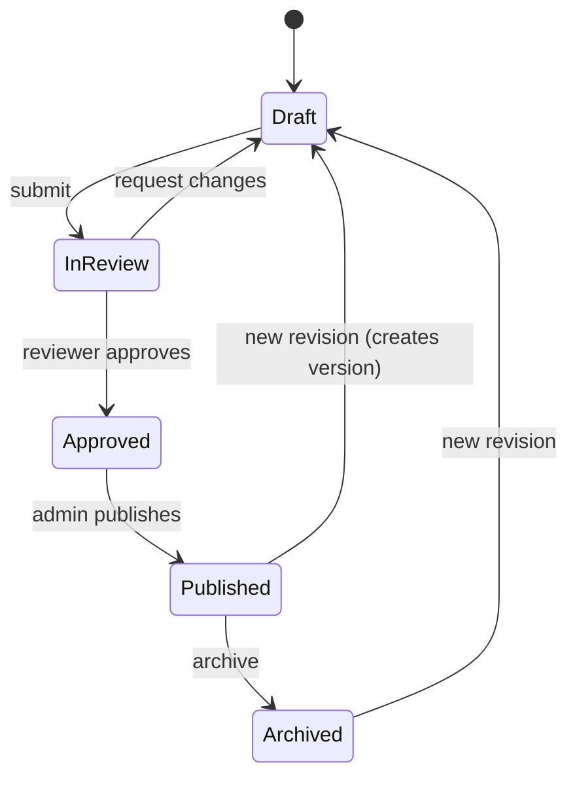
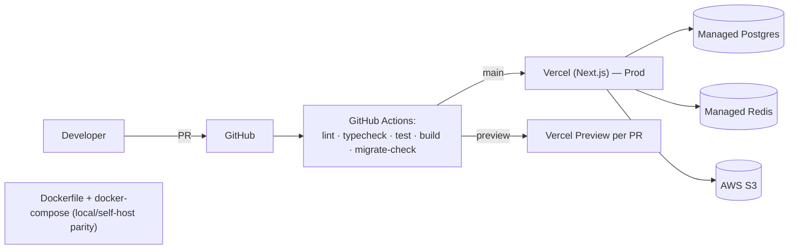

# Bhavishya IAS — System Architecture

**Document:** Phase 2 Deliverable
**Version:** 1.0
**Status:** Draft — Awaiting Approval
**Depends on:** `docs/01-PRD.md` (Phase 1)
**Last Updated:** 2026-07-04

> This document defines **how** the system is structured to satisfy the PRD. It
> stops short of concrete schema (Phase 3), pixels (Phase 4–5), and folder layout
> (Phase 6). Requirement IDs (`FR-*`, `NFR-*`) reference the PRD.

---

## 1. Architectural Goals & Principles

Derived directly from the PRD's moat (structured, interlinked knowledge graph)
and NFRs.

1. **Modular monolith first.** One deployable Next.js application organised into
   strict internal modules with clear boundaries — not microservices. This gives
   us velocity now and clean seams to extract services later. (**NFR-MNT**)
2. **API-first.** Every capability is exposed through a versioned HTTP API that a
   future mobile/desktop app can consume identically to the web client. The web
   UI is just the first client. (**PRD §12 roadmap**)
3. **Layered & typed end-to-end.** UI → API (route handlers) → Service (domain
   logic) → Repository (Prisma) → Postgres. Types flow through Zod + Prisma so a
   change in the DB surfaces as a compile error in the UI.
4. **Deny-by-default security.** Authorization is enforced in the service layer on
   every mutation and protected read — never in the UI, never trusting the client.
   (**FR-SEC-01**)
5. **Swappable infrastructure via interfaces.** Search, storage, cache, and mail
   sit behind interfaces. Launch uses Postgres FTS + S3 + Redis + SMTP; each can
   be swapped (e.g. Meilisearch) without touching domain code. (**Decisions §15**)
6. **Exam-scoped multitenancy.** A single database with `examId` scoping on every
   scoped entity; scoping is applied centrally, not sprinkled ad-hoc. (**Decision #4**)
7. **Content lifecycle is first-class.** Draft → Review → Approved → Published →
   Archived is modelled once and reused by every content type. (**FR-NOTE-04**)
8. **Server-first rendering** for content (SSR/ISR) for SEO + speed; interactivity
   hydrates on top. (**NFR-PERF, NFR-SEO**)

---

## 2. High-Level System Diagram

---

## 3. Logical Layering

Every request passes through the same lanes. Responsibilities are strict.

| Layer | Responsibility | Must NOT |
|-------|----------------|----------|
| **Presentation** (React Server/Client Components) | Rendering, forms, client cache (TanStack Query), optimistic UI | Contain business rules or DB access |
| **API / Route Handlers** | HTTP contract: parse, validate (Zod), map to service calls, shape responses, status codes | Contain domain logic |
| **Service (Domain)** | Business rules, **authorization (RBAC)**, transactions, orchestration, workflow state transitions | Know about HTTP or React |
| **Repository** | Data access via Prisma, query composition, `examId` scoping | Contain business rules |
| **Ports/Adapters** | Search, Storage, Cache, Mail, Jobs behind interfaces | Leak vendor specifics upward |

**Rule of dependency:** dependencies point inward (Presentation → Service →
Repository). Ports are injected into services (dependency inversion — the **D** in
SOLID) so tests can substitute fakes.

---

## 4. Module Architecture (bounded contexts)

The monolith is partitioned into modules that map to PRD modules. Each owns its
services, repositories, API routes, and Zod schemas. Cross-module access goes
through a module's public service API — never by reaching into another module's
repositories.

**Key relationships**

- **Taxonomy** is the spine (the syllabus graph). Content and Progress reference
  taxonomy nodes; nothing edits taxonomy except the Taxonomy/Admin surface.
- **Content** is polymorphic: notes, PYQs, model answers, judgments, schemes,
  flashcards, etc. all share the lifecycle and linking model (PRD §6). The exact
  polymorphic strategy is a Phase 3 decision, flagged there.
- **Workflow** owns the state machine + versioning + audit trail and is reused by
  every content type — implemented once.

---

## 5. API Strategy

- **Transport:** JSON over HTTPS via Next.js Route Handlers under `/api/v1/...`.
  Versioned from day one so mobile clients bind to a stable contract.
- **Style:** resource-oriented REST with predictable verbs and status codes.
  (GraphQL/tRPC considered — see ADR-2 — REST chosen for client-agnostic reach.)
- **Validation:** every handler validates input with a **Zod** schema; the same
  schemas are shared with the client forms (React Hook Form + Zod resolver) for a
  single source of truth. (**FR-SEC-04**)
- **Responses:** consistent envelope — `{ data, error, meta }`; cursor-based
  pagination for lists (`meta.nextCursor`) to support infinite scroll. (**NFR-PERF**)
- **Errors:** typed error taxonomy (validation / auth / not-found / conflict /
  rate-limit / server) mapped to correct HTTP codes; no stack leakage.
- **Idempotency:** mutating endpoints that can be retried (e.g. imports) accept an
  idempotency key.
- **Docs:** OpenAPI generated and published (Phase 7 deliverable `docs/07-api.md`).

Server Components read data by calling **services directly** (no self-HTTP hop);
Route Handlers exist for client-side mutations/queries and external clients. Both
paths funnel through the same service layer, so authorization is identical.

---

## 6. Authentication & Authorization Architecture

### 6.1 Authentication (Auth.js / NextAuth)

- Providers: **Email/password** + **Google OAuth** + **email OTP** (Decision #1 —
  email-only OTP; `phone` field reserved for future SMS).
- Sessions: httpOnly, secure, sameSite cookies; short-lived access with rotating
  refresh; "logout everywhere" via server-side session invalidation in Redis.
  (**FR-AUTH-05, FR-SEC-02**)
- Email verification + password reset use expiring, single-use tokens (**FR-AUTH-04**).

### 6.2 Authorization (RBAC)

- **Model:** Users have Roles; Roles map to Permissions (data-driven, not
  hardcoded — new roles/exam-teams without redeploy). (**PRD §3.2**)
- **Enforcement point:** a single `authorize(actor, action, resource)` guard in the
  service layer, called before every protected operation. UI hides what a user
  can't do, but the server is the authority. (**FR-SEC-01**)
- **Separation of duties:** the guard encodes rules like "Editor ≠ approver of own
  content"; Reviewer approves, Admin/Super Admin publishes. (**PRD §3.2**)
- **Exam scoping:** every authorization check and every scoped query carries
  `examId`; a central scoping helper prevents cross-exam data leakage. (**Decision #4**)
- **Audit:** the guard emits an audit event for privileged/mutating actions to the
  audit log. (**FR-SEC-06**)

---

## 7. Data & Persistence

- **PostgreSQL** via **Prisma**. Single database; **`examId`** on every scoped
  entity. Repository layer applies scoping centrally.
- **Migrations:** Prisma Migrate, versioned in-repo, applied via CI.
- **Search (v1): PostgreSQL Full-Text Search** — `tsvector` columns + GIN indexes,
  behind a `SearchPort` interface. Only **published** content is indexed for
  students. Swappable to Meilisearch later with zero domain change. (**Decision #2,
  FR-SRCH-04**)
- **Read performance:** heavy content pages served via ISR + Redis-cached service
  reads; pagination everywhere. (**NFR-PERF**)
- Full normalized schema, indexes, constraints, and ERD are **Phase 3**.

---

## 8. Caching Strategy (Redis)

| Use | Pattern | Invalidation |
|-----|---------|--------------|
| Sessions & OTP throttling | Redis as source of truth | TTL / logout |
| Rate limiting | Fixed/sliding window counters | TTL |
| Hot content reads (published notes, syllabus tree) | Cache-aside with tagged keys | On publish/edit via workflow events |
| Expensive aggregates (dashboards, analytics) | Cache-aside, short TTL | TTL + on write |
| Next.js data cache / ISR | Framework-level | Revalidate on publish |

Cache is **never** the system of record and the app degrades gracefully if Redis
is unavailable (falls back to DB). (**NFR-OPS**)

---

## 9. Storage & Media (AWS S3)

- **S3 (or S3-compatible)** is the primary store for images, PDFs, uploaded answer
  scripts, and documents. (**Decision #3**)
- Uploads use **pre-signed URLs** (client → S3 directly) to avoid proxying large
  files through the app; the app records metadata + validates type/size.
- Public content served via CDN; private assets (answer scripts) via short-lived
  signed URLs gated by RBAC.
- A `StoragePort` interface isolates S3 so Cloudinary/others can be added later.

---

## 10. Content Lifecycle & Editorial Workflow

The workflow engine is shared by all content types (notes, PYQs, model answers,
current affairs, etc.).

- **Versioning:** every publish/edit creates an immutable version; diff + restore
  supported. (**FR-NOTE-03**)
- **Auto-save** writes to Draft; publish is explicit. (**FR-NOTE-02**)
- Transitions are permission-gated and audit-logged; changing state emits domain
  events that trigger cache invalidation, search re-index, and notifications.

---

## 11. Background Jobs & Events

Launch keeps it simple — a lightweight job runner (queue in Redis) for async work;
no external broker at v1. A `JobPort` interface allows moving to a managed queue
(SQS, etc.) later.

Async workloads: search (re)indexing on publish, email sending, bulk imports/OCR
(**FR-CM-***), PDF export generation, analytics rollups, thumbnail processing.

Domain events (e.g. `ContentPublished`, `AnswerSubmitted`) are the integration
seam between modules — modules react to events rather than calling each other
directly where practical, keeping boundaries clean and future extraction easy.

---

## 12. Cross-Cutting Concerns

### 12.1 Security (**FR-SEC-***, NFR-SEC)
- Middleware: security headers (CSP, HSTS, X-Frame-Options), CSRF protection for
  cookie-based mutations, and per-route rate limiting.
- Input validated with Zod at every boundary; Prisma parameterization prevents
  SQLi; output encoding + sanitisation of rich content prevents XSS.
- Secrets via environment/secret manager, never in source (`.env` gitignored).
- Audit log for privileged actions; PII minimised and access-controlled.

### 12.2 Observability (**NFR-OPS**)
- Structured JSON logging with request IDs; error tracking (e.g. Sentry-class);
  health/readiness endpoints; key business + performance metrics for the §2.2 KPIs.

### 12.3 Performance (**NFR-PERF**)
- SSR/ISR, code splitting, lazy loading, image optimization, cursor pagination /
  infinite scroll, Redis + CDN caching. Web-vitals budgets enforced in CI.

### 12.4 SEO (**NFR-SEO**)
- Per-route metadata, canonical URLs, OpenGraph, Schema.org (Course/Article/FAQ),
  generated `sitemap.xml` + `robots.txt`. Content pages are server-rendered.

### 12.5 Accessibility (**NFR-A11Y**)
- shadcn/ui (Radix) primitives give accessible semantics; keyboard nav, focus
  management, contrast, and screen-reader labels are acceptance criteria, tested
  in CI (axe).

---

## 13. Deployment Topology

- **Primary:** Vercel for the Next.js app; managed Postgres + Redis; AWS S3 for media.
- **Docker:** a `Dockerfile` + `docker-compose` (app + Postgres + Redis) gives
  local dev parity and a self-host escape hatch (avoids lock-in). (**PRD constraints**)
- **CI/CD (GitHub Actions):** lint → typecheck → unit/integration tests →
  build → migration safety check; preview deploy per PR; promote on merge to `main`.
- **Environments:** local, preview (per-PR), production. Migrations run as a gated
  CI step. Secrets per-environment.

---

## 14. Scalability & Roadmap Enablement

How this architecture keeps PRD §12 open:

| Future | Enabled by |
|--------|-----------|
| **Mobile / Desktop apps** | API-first `/api/v1`; UI is just one client |
| **Offline mode** | Stable content IDs + REST API make client-side sync feasible |
| **AI Tutor / RAG** | The interlinked knowledge graph is an ideal retrieval corpus; a service can read published content via the same repositories |
| **Payments / Subscriptions** | Billing-ready user model + entitlement checks slot into the RBAC/authorize guard |
| **Community / Marketplace / Mentorship** | New modules added as bounded contexts; event bus already the integration seam |
| **Live Classes** | New module + media/streaming adapter; no core rework |
| **Search upgrade (Meilisearch)** | Swap the `SearchPort` adapter |
| **Service extraction** | Clean module boundaries + events allow lifting a context (e.g. Tests) into its own service |

**Scaling path:** vertical + Vercel autoscale first → read replicas & aggressive
caching → extract hot modules to services only when data proves the need. We do
**not** pre-optimise into microservices.

---

## 15. Architecture Decision Records (summary)

| ADR | Decision | Why | Alternatives rejected |
|-----|----------|-----|-----------------------|
| ADR-1 | **Modular monolith**, not microservices | Velocity, one deploy, clean seams for later | Microservices (premature ops cost) |
| ADR-2 | **REST API** under `/api/v1` | Client-agnostic (mobile/AI later), cacheable, simple | tRPC (TS-only), GraphQL (overhead for v1) |
| ADR-3 | **Postgres FTS** at launch behind a port | No new infra; good enough; swappable | Meilisearch/ES now (added ops before need) |
| ADR-4 | **Single DB + `examId` scoping** | Simplicity, cross-exam reuse, one migration path | Schema-per-exam (operational sprawl) |
| ADR-5 | **Shared content lifecycle + versioning engine** | Every content type needs Draft→Published + versions; build once | Per-type ad-hoc workflows (duplication) |
| ADR-6 | **Ports & adapters** for search/storage/cache/mail/jobs | Swap infra without touching domain; testable | Direct vendor calls in services (lock-in) |
| ADR-7 | **Auth.js** for auth | Batteries-included, Google+Email+OTP, session mgmt | Rolling our own (risk) |
| ADR-8 | **Server-first rendering** for content | SEO + performance for the core reading experience | SPA/CSR (bad SEO for content moat) |

---

## 16. Phase 2 Exit Criteria

- Approval of: layering, module boundaries, API strategy, auth/RBAC enforcement
  model, data/search/cache/storage approach, workflow engine, deployment topology,
  and the ADRs above.
- On approval → **Phase 3: Database Design** (normalized schema for the syllabus
  graph + polymorphic content + workflow/versioning + RBAC + progress/tests,
  with indexes, constraints, and an ER diagram).

**Approval:** _Pending stakeholder review._
