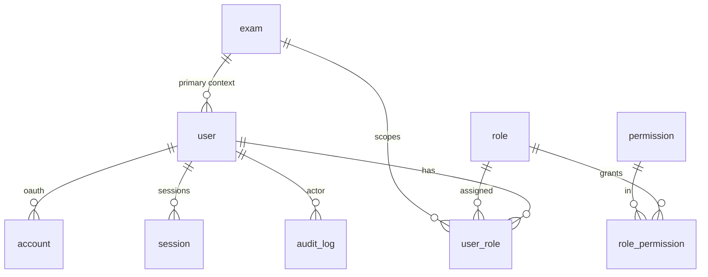
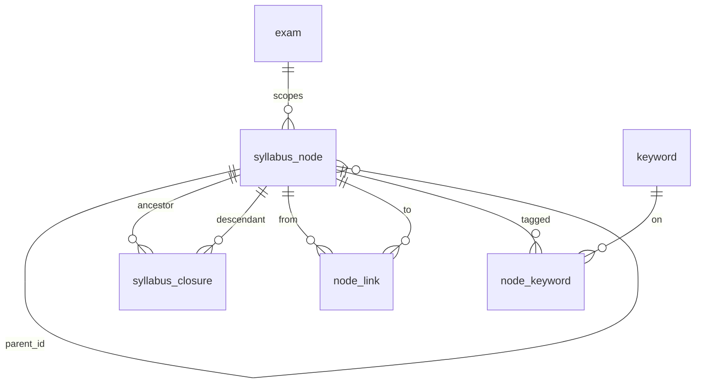
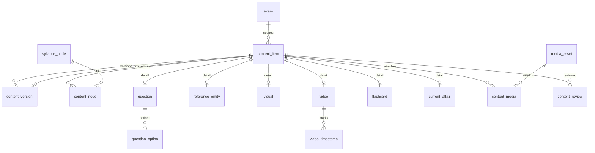
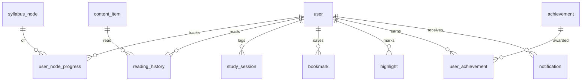
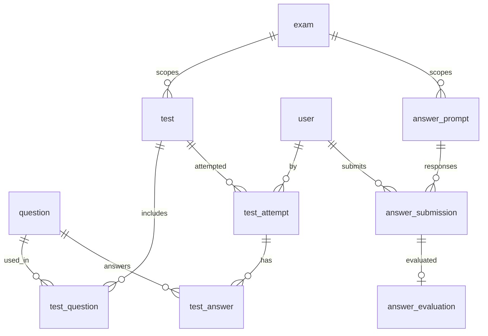

# Bhavishya IAS — Database Design

**Document:** Phase 3 Deliverable
**Version:** 1.0
**Status:** Draft — Awaiting Approval
**Depends on:** `docs/01-PRD.md`, `docs/02-architecture.md`
**Engine:** PostgreSQL 15+ · **ORM:** Prisma
**Last Updated:** 2026-07-04

> Normalized PostgreSQL schema for the whole platform: the syllabus graph, the
> polymorphic content model, editorial workflow + versioning, RBAC, progress,
> tests, answer-writing, current affairs, and search. Includes enums, keys,
> foreign keys, constraints, indexes, and domain-grouped ER diagrams. Actual
> `prisma/schema.prisma` is generated in Phase 7 from this design.

---

## 1. Design Decisions (the calls I made)

| # | Decision | Rationale (why this is the popular, cost-effective choice) |
|---|----------|------------------------------------------------------------|
| **D1** | **Polymorphic content = Class Table Inheritance**: a shared `content_item` base + typed detail tables (`question`, `reference_entity`, `video`, `flashcard`, …). | Common concerns (lifecycle, versioning, exam scope, ownership, linking, search) are modelled **once** on the base; type-specific columns live in slim detail tables. Standard CMS pattern; avoids the sparse nullable columns of Single-Table-Inheritance and the duplication of fully-separate tables. |
| **D2** | **Rich bodies stored as validated JSONB** (`content_version.body`), not shredded into rows. | TipTap/ProseMirror documents are trees; JSONB keeps them intact, cheap to read in one row, and still queryable. What we *filter/join/scope* on stays relational. This is how Notion-style and headless CMS platforms store documents. |
| **D3** | **Syllabus graph = adjacency (`parent_id`) + closure table** (`syllabus_closure`). | Arbitrary depth (PRD `FR-SYL-02`), O(1) subtree/ancestor queries, cheap "all descendants" for coverage %. Closure tables are the widely-adopted hierarchy pattern in Postgres when reads dominate. Interlinks (`node_link`) are a separate many-to-many graph. |
| **D4** | **Immutable versioning** via `content_version` rows; `content_item.current_version_id` points at the live one. | Publish/edit never mutates history → diff + restore (`FR-NOTE-03`) for free; audit-friendly. |
| **D5** | **`exam_id` on every scoped entity**, FK to `exam`. | Single-DB multitenancy (Decision #4); central scoping in the repository layer. |
| **D6** | **Auth.js-native tables** (`account`, `session`, `verification_token`) kept as the library expects, extended with our `user`/RBAC tables. | Zero friction with the auth library; don't fight the framework. |
| **D7** | **Postgres FTS**: a `tsvector` `search_vector` column on searchable tables, GIN-indexed, kept current by triggers; students query `status = PUBLISHED` only. | No extra infra at launch (Decision #2); swappable to Meilisearch behind the `SearchPort`. |
| **D8** | **Soft delete** (`deleted_at`) on user-facing content + hard FKs elsewhere; UUID (v7) primary keys. | Recoverability + stable, non-guessable, time-sortable IDs good for distributed/mobile-sync futures. |
| **D9** | **Polymorphic associations** (bookmarks, highlights, media links) use an explicit `(target_type, target_id)` pair **guarded by a CHECK + partial unique indexes**, not a loose "morph" with no integrity. | Keeps the flexibility CMSs need without abandoning referential safety. |

**Conventions:** `snake_case` tables/columns; PK `id UUID` (UUIDv7); timestamps
`created_at`/`updated_at` (`timestamptz`, UTC); every FK indexed; enums as native
Postgres `enum` types (mirrored as Prisma enums). Money/none at launch.

---

## 2. Enumerated Types

```sql
CREATE TYPE user_status          AS ENUM ('PENDING','ACTIVE','SUSPENDED','DEACTIVATED');
CREATE TYPE role_key             AS ENUM ('STUDENT','FACULTY','CONTENT_EDITOR','REVIEWER','ADMIN','SUPER_ADMIN');

CREATE TYPE node_type            AS ENUM ('SUBJECT','UNIT','THEME','SUB_THEME','MICRO_THEME','CONCEPT');
CREATE TYPE node_link_type       AS ENUM ('RELATED','PREREQUISITE','CONTEMPORARY_LINKAGE','VALUE_ADDITION','CROSS_REFERENCE');
CREATE TYPE node_progress_status AS ENUM ('NOT_STARTED','IN_PROGRESS','REVISED','MASTERED');

CREATE TYPE content_type         AS ENUM ('NOTE','MICRO_TOPIC','MODEL_ANSWER','FAQ','EDITORIAL',
                                          'QUESTION','REFERENCE','VISUAL','VIDEO','FLASHCARD',
                                          'CURRENT_AFFAIR');
CREATE TYPE content_status       AS ENUM ('DRAFT','IN_REVIEW','APPROVED','PUBLISHED','ARCHIVED');
CREATE TYPE difficulty           AS ENUM ('EASY','MEDIUM','HARD');

CREATE TYPE question_kind        AS ENUM ('MCQ','DESCRIPTIVE');
CREATE TYPE exam_stage           AS ENUM ('PRELIMS','MAINS','INTERVIEW');

CREATE TYPE reference_kind       AS ENUM ('JUDGMENT','SCHEME','REPORT','ACT','ARTICLE','STATISTIC','COMMITTEE');
CREATE TYPE visual_kind          AS ENUM ('FLOWCHART','MIND_MAP','DIAGRAM','INFOGRAPHIC','TABLE','MAP');
CREATE TYPE media_kind           AS ENUM ('IMAGE','SVG','PDF','DOC','OTHER');

CREATE TYPE ca_cadence           AS ENUM ('DAILY','WEEKLY','MONTHLY');
CREATE TYPE ca_region            AS ENUM ('ANDHRA_PRADESH','NATIONAL','INTERNATIONAL');

CREATE TYPE test_kind            AS ENUM ('TOPIC','SUBJECT','FULL','PREVIOUS_PAPER','CUSTOM');
CREATE TYPE attempt_status       AS ENUM ('IN_PROGRESS','SUBMITTED','EXPIRED','ABANDONED');

CREATE TYPE review_decision      AS ENUM ('APPROVED','CHANGES_REQUESTED','REJECTED');
CREATE TYPE bookmark_target      AS ENUM ('NODE','CONTENT');
CREATE TYPE aw_cadence           AS ENUM ('DAILY','WEEKLY','TOPIC');
CREATE TYPE submission_status    AS ENUM ('SUBMITTED','UNDER_EVALUATION','EVALUATED','RETURNED');
```

---

## 3. Domain 1 — Identity, Access & Audit

### Tables

**`exam`** — the multitenancy root.
| Column | Type | Notes |
|---|---|---|
| id | uuid PK | |
| key | text | unique, e.g. `APPSC_GROUP_1` |
| name | text | "APPSC Group-1" |
| description | text | |
| is_active | boolean | default true |
| created_at / updated_at | timestamptz | |

**`user`** — extends Auth.js.
| Column | Type | Notes |
|---|---|---|
| id | uuid PK | |
| email | citext | **unique** |
| email_verified_at | timestamptz | null until verified |
| password_hash | text | null for OAuth-only accounts |
| name | text | |
| avatar_url | text | |
| phone | text | nullable — reserved for future SMS OTP (Decision #1) |
| status | user_status | default `PENDING` |
| primary_exam_id | uuid FK → exam | user's default exam context |
| preferences | jsonb | UI/theme/study prefs |
| last_login_at | timestamptz | |
| created_at / updated_at / deleted_at | timestamptz | soft delete |

**Auth.js standard:** `account` (OAuth links), `session`, `verification_token`
— kept per library contract, `account.user_id`/`session.user_id` → `user`.

**RBAC:** `role`, `permission`, `role_permission`, `user_role`.
| Table | Key columns | Notes |
|---|---|---|
| `role` | id, key `role_key` (unique), name, description | Data-driven roles |
| `permission` | id, key text (unique, e.g. `content:publish`), description | Fine-grained actions |
| `role_permission` | (role_id, permission_id) PK | Many-to-many |
| `user_role` | (user_id, role_id) PK, exam_id (nullable), granted_by, created_at | **Role can be scoped to an exam**; null = global |

> A user's effective permissions = union of permissions across their roles,
> filtered by `exam_id` when the check is exam-scoped. Enforced by the service
> layer's `authorize()` guard (Phase 2 §6).

**`audit_log`** — every privileged/mutating action (`FR-SEC-06`).
| Column | Type | Notes |
|---|---|---|
| id | uuid PK | |
| actor_id | uuid FK → user | nullable (system actions) |
| action | text | e.g. `content.publish` |
| target_type | text | table/entity name |
| target_id | uuid | |
| exam_id | uuid FK → exam | nullable |
| metadata | jsonb | before/after, request id, ip |
| created_at | timestamptz | |



---

## 4. Domain 2 — Syllabus Graph (Taxonomy)

**`syllabus_node`** — typed node in the graph (`FR-SYL-01..08`).
| Column | Type | Notes |
|---|---|---|
| id | uuid PK | globally unique, stable (`FR-SYL-01`) |
| exam_id | uuid FK → exam | scoping (`FR-SYL-04`) |
| parent_id | uuid FK → syllabus_node | null for roots (adjacency, D3) |
| type | node_type | SUBJECT…CONCEPT |
| title | text | |
| slug | text | unique within (exam_id, parent_id) |
| summary | text | |
| order_index | int | authorable ordering (`FR-SYL-08`) |
| exam_angle | text | node-level exam relevance |
| search_vector | tsvector | GIN indexed (D7) |
| created_at / updated_at / deleted_at | timestamptz | |

Constraints: `UNIQUE (exam_id, parent_id, slug)`; `CHECK (parent_id <> id)`;
a node's `exam_id` must equal its parent's `exam_id` (enforced in service +
optional trigger).

**`syllabus_closure`** — transitive ancestry (D3).
| Column | Type | Notes |
|---|---|---|
| ancestor_id | uuid FK → syllabus_node | |
| descendant_id | uuid FK → syllabus_node | |
| depth | int | 0 = self |
| PK | (ancestor_id, descendant_id) | |

**`node_link`** — arbitrary interlinking graph (`FR-SYL-03`).
| Column | Type | Notes |
|---|---|---|
| id | uuid PK | |
| from_node_id | uuid FK → syllabus_node | |
| to_node_id | uuid FK → syllabus_node | |
| type | node_link_type | RELATED / CONTEMPORARY_LINKAGE / … |
| note | text | |
| UNIQUE | (from_node_id, to_node_id, type) | |

`CHECK (from_node_id <> to_node_id)`.

**`keyword`** (id, exam_id, term unique-per-exam) + **`node_keyword`**
((node_id, keyword_id) PK) — the keyword facet, reusable across nodes.



---

## 5. Domain 3 — Content (polymorphic core) & Workflow

### 5.1 Base envelope + versioning (D1, D2, D4)

**`content_item`** — the shared base for every content type.
| Column | Type | Notes |
|---|---|---|
| id | uuid PK | |
| exam_id | uuid FK → exam | scoping |
| type | content_type | discriminator |
| title | text | |
| slug | text | unique within (exam_id, type) |
| status | content_status | workflow state (Phase 2 §10) |
| current_version_id | uuid FK → content_version | live version (nullable while first draft forms) |
| author_id | uuid FK → user | creator |
| difficulty | difficulty | nullable (used by QUESTION) |
| reading_time_seconds | int | computed (`FR-NOTE-05`) |
| search_vector | tsvector | GIN (D7) |
| published_at | timestamptz | set on first publish |
| created_at / updated_at / deleted_at | timestamptz | |

**`content_version`** — immutable snapshots (`FR-NOTE-03`).
| Column | Type | Notes |
|---|---|---|
| id | uuid PK | |
| content_item_id | uuid FK → content_item | |
| version_number | int | monotonic per item |
| body | jsonb | TipTap/ProseMirror doc (D2) |
| plain_text | text | derived, feeds search_vector |
| change_note | text | |
| created_by_id | uuid FK → user | |
| created_at | timestamptz | |
| UNIQUE | (content_item_id, version_number) | |

> Auto-save writes to the working draft version; publish sets
> `content_item.current_version_id` and `status = PUBLISHED`.

**`content_node`** — links content ↔ syllabus nodes, many-to-many (`FR-MTK-03`,
`FR-PYQ-03`, `FR-NOTE-07`).
| Column | Type | Notes |
|---|---|---|
| content_item_id | uuid FK → content_item | |
| node_id | uuid FK → syllabus_node | |
| relation | text | `PRIMARY` \| `RELATED` |
| order_index | int | |
| PK | (content_item_id, node_id) | |

### 5.2 Typed detail tables (one row per matching `content_item`)

**`question`** — MCQs **and** PYQs (`FR-PYQ-02`, `FR-TEST-05`).
| Column | Type | Notes |
|---|---|---|
| content_item_id | uuid PK, FK → content_item | 1:1 with a `QUESTION` item |
| kind | question_kind | MCQ / DESCRIPTIVE |
| stage | exam_stage | PRELIMS / MAINS / INTERVIEW |
| is_pyq | boolean | true = previous-year |
| year | int | PYQ year (nullable) |
| paper | text | e.g. "Paper II" |
| marks | numeric(5,2) | |
| source | text | |
| explanation | jsonb | rich explanation (nullable) |
| model_answer_item_id | uuid FK → content_item | a `MODEL_ANSWER` item (nullable) |

**`question_option`** — MCQ options.
| Column | Type | Notes |
|---|---|---|
| id | uuid PK | |
| question_item_id | uuid FK → question | |
| label | text | A/B/C/D |
| text | text | |
| is_correct | boolean | |
| order_index | int | |

Constraint (enforced in service + trigger): an `MCQ` question has ≥2 options and
**exactly one** `is_correct = true`.

**`reference_entity`** — Judgments/Schemes/Reports/Acts/Articles/Statistics/
Committees (PRD §6). Shared library, authored once, linked to many nodes.
| Column | Type | Notes |
|---|---|---|
| content_item_id | uuid PK, FK → content_item | |
| kind | reference_kind | discriminator |
| citation | text | case citation / act number / report id |
| authority | text | court / ministry / body |
| year | int | |
| source_url | text | |
| attributes | jsonb | kind-specific fields (ratio, objectives, findings…) |

**`visual`** — Flowcharts/Mind-maps/Diagrams/Infographics/Tables/Maps.
| Column | Type | Notes |
|---|---|---|
| content_item_id | uuid PK, FK → content_item | |
| kind | visual_kind | |
| media_asset_id | uuid FK → media_asset | rendered image/SVG (nullable) |
| spec | jsonb | structured diagram spec (nullable) |

**`video`** — YouTube embeds (`FR-VID-*`).
| Column | Type | Notes |
|---|---|---|
| content_item_id | uuid PK, FK → content_item | |
| provider | text | default `YOUTUBE` |
| external_id | text | video id |
| url | text | |
| duration_seconds | int | |

**`video_timestamp`** — (id, video_item_id FK, label, seconds, order_index).

**`flashcard`** — (content_item_id PK/FK, front jsonb, back jsonb, deck_id FK →
`flashcard_deck` nullable). **`flashcard_deck`** — (id, exam_id, title, owner_id).

**`current_affair`** — detail for `CURRENT_AFFAIR` items (`FR-CA-*`).
| Column | Type | Notes |
|---|---|---|
| content_item_id | uuid PK, FK → content_item | |
| cadence | ca_cadence | DAILY/WEEKLY/MONTHLY |
| region | ca_region | AP / NATIONAL / INTERNATIONAL |
| category | text | economy/environment/IR/scheme… (also linked via node) |
| publish_date | date | |

> **Notes, Micro-topics, Model Answers, FAQs, Editorials** need no detail table —
> they are `content_item` + `content_version(body)` with links via `content_node`.
> The micro-topic's many sections (`FR-MTK-01`) live as structured blocks inside
> the JSONB `body`, deep-linkable by block id.

### 5.3 Media & attachments

**`media_asset`** — S3-backed files (Decision #3, Phase 2 §9).
| Column | Type | Notes |
|---|---|---|
| id | uuid PK | |
| exam_id | uuid FK → exam | nullable (shared assets) |
| kind | media_kind | IMAGE/SVG/PDF/DOC |
| s3_key | text | unique |
| mime_type | text | |
| size_bytes | bigint | |
| width / height | int | for images |
| checksum | text | dedupe |
| uploaded_by_id | uuid FK → user | |
| created_at | timestamptz | |

**`content_media`** — attach assets to content ((content_item_id, media_asset_id)
PK, role text e.g. `INLINE`/`DOWNLOAD`/`THUMBNAIL`, order_index).

### 5.4 Editorial workflow

State machine lives on `content_item.status` (Phase 2 §10). Review records:

**`content_review`**
| Column | Type | Notes |
|---|---|---|
| id | uuid PK | |
| content_item_id | uuid FK → content_item | |
| version_id | uuid FK → content_version | version under review |
| reviewer_id | uuid FK → user | |
| decision | review_decision | APPROVED/CHANGES_REQUESTED/REJECTED |
| comment | text | |
| created_at | timestamptz | |

> **Separation of duties** (`FR-NOTE-04`, PRD §3.2): a `CHECK`/service rule forbids
> `reviewer_id = content_item.author_id`. Transitions are audit-logged.



---

## 6. Domain 4 — Learning, Progress & Personalisation

**`user_node_progress`** (`FR-SYL-06`, `FR-ANL-01`, `FR-DASH-03`)
| Column | Type | Notes |
|---|---|---|
| user_id | uuid FK → user | |
| node_id | uuid FK → syllabus_node | |
| status | node_progress_status | |
| revision_count | int | default 0 |
| last_visited_at | timestamptz | |
| next_revision_at | timestamptz | spaced revision (`FR-DASH-03`) |
| PK | (user_id, node_id) | |

**`reading_history`** (`FR-AUTH-08`, `FR-ANL-01`) — (id, user_id, content_item_id,
progress_percent, duration_seconds, read_at). Feeds "continue reading".

**`study_session`** — (id, user_id, node_id nullable, started_at, ended_at,
duration_seconds) → study-hours analytics (`FR-DASH-02`).

**`bookmark`** (polymorphic, D9) — (id, user_id, target_type `bookmark_target`,
node_id nullable, content_item_id nullable, created_at).
Constraint: exactly one of `node_id`/`content_item_id` non-null, matching
`target_type`; partial unique indexes prevent duplicates.

**`highlight`** (`FR-NOTE-05`) — (id, user_id, content_item_id, version_id, range
jsonb, color, note, created_at).

**`achievement`** + **`user_achievement`** — (achievement: id, key, name,
description, criteria jsonb) / (user_id, achievement_id, earned_at) — `FR-AUTH-08`.

**`notification`** (`FR-NTF-02`) — (id, user_id, type, payload jsonb, read_at,
created_at).



---

## 7. Domain 5 — Tests & Answer Writing

**`test`** (`FR-TEST-01..04`)
| Column | Type | Notes |
|---|---|---|
| id | uuid PK | |
| exam_id | uuid FK → exam | |
| kind | test_kind | TOPIC/SUBJECT/FULL/PREVIOUS_PAPER/CUSTOM |
| title | text | |
| duration_seconds | int | timer |
| marks_per_question | numeric(5,2) | default |
| negative_mark | numeric(5,2) | negative marking |
| status | content_status | reuse lifecycle |
| created_by_id | uuid FK → user | |
| created_at / updated_at | timestamptz | |

**`test_question`** — ((test_id, question_item_id) PK, order_index, marks override
nullable). Reuses the shared `question` bank (`FR-TEST-05`).

**`test_attempt`** — (id, test_id, user_id, status `attempt_status`, started_at,
submitted_at, score numeric, total_marks numeric, duration_seconds).

**`test_answer`** — (id, attempt_id FK, question_item_id FK, selected_option_id FK
nullable, is_correct, marks_awarded numeric, time_spent_seconds).
Unique (attempt_id, question_item_id). Server-scored (`FR-TEST-04`); leaderboard is
a materialized view over submitted attempts (`FR-TEST-03`).

**Answer Writing** (Tier 2, schema-ready; AI eval deferred per Decision #5):
- **`answer_prompt`** — (id, exam_id, question_item_id FK nullable, cadence
  `aw_cadence`, prompt jsonb, publish_date, created_by_id).
- **`answer_submission`** — (id, prompt_id FK, user_id FK, media_asset_id FK
  nullable (PDF), text_body jsonb nullable, status `submission_status`,
  submitted_at). (`FR-AW-02`)
- **`answer_evaluation`** — (id, submission_id FK, evaluator_id FK → user,
  rubric_scores jsonb, total_score numeric, comments jsonb, evaluated_at).
  (`FR-AW-03`; AI eval `FR-AW-04` deferred.)



---

## 8. Search (Decision #2, D7)

- `search_vector tsvector` columns on `content_item`, `syllabus_node`,
  (and `reference_entity.attributes` weighted) maintained by triggers on
  insert/update of title + `content_version.plain_text`.
- **GIN** indexes on each `search_vector`.
- Weighting: title = `A`, keywords = `B`, body = `C`.
- Student queries filter `status = 'PUBLISHED' AND deleted_at IS NULL AND exam_id = :exam`
  (`FR-SRCH-04`). Editors search drafts within permission.
- All access goes through the `SearchPort`; swap to Meilisearch later with no
  schema change to callers.

---

## 9. Indexing Strategy (beyond PKs/uniques)

| Table | Index | Purpose |
|---|---|---|
| syllabus_node | `(exam_id, parent_id, order_index)` | render ordered tree |
| syllabus_node | GIN `search_vector` | search |
| syllabus_closure | `(descendant_id, depth)` | ancestors/breadcrumb |
| node_link | `(to_node_id, type)` | reverse links |
| content_item | `(exam_id, type, status, published_at DESC)` | listing/feeds |
| content_item | GIN `search_vector` | search |
| content_item | `(status) WHERE deleted_at IS NULL` partial | published feeds |
| content_version | `(content_item_id, version_number DESC)` | history/latest |
| content_node | `(node_id, relation)` | "content on this node" |
| question | `(stage, is_pyq, year)`; `(difficulty)` | PYQ browse (`FR-PYQ-04`) |
| current_affair | `(cadence, publish_date DESC)`, `(region)` | CA feeds |
| user_node_progress | `(user_id, status)`; `(user_id, next_revision_at)` | dashboard/revision |
| reading_history | `(user_id, read_at DESC)` | continue-reading |
| test_attempt | `(test_id, score DESC)`; `(user_id, submitted_at DESC)` | leaderboard/history |
| audit_log | `(target_type, target_id, created_at DESC)`; `(actor_id)` | audits |
| user | unique `email`; `(status)` | auth |
| media_asset | unique `s3_key`; `(checksum)` | dedupe |

---

## 10. Integrity & Constraints (summary)

- **Exam consistency:** child `syllabus_node.exam_id` = parent's; `content_node`
  links only same-exam node↔content (service-enforced, optional triggers).
- **Workflow:** legal `content_status` transitions enforced in the workflow
  service; `content_review.reviewer_id <> author_id` (separation of duties).
- **MCQ validity:** exactly one correct option; ≥2 options (trigger + service).
- **Polymorphic safety (D9):** `bookmark` CHECK — exactly one target FK set and it
  matches `target_type`; partial unique indexes stop duplicate bookmarks.
- **Soft delete:** feeds/search exclude `deleted_at IS NOT NULL`.
- **Cascades:** deleting a `content_item` cascades to its versions/detail/links;
  deleting a `user` is a soft delete (content authorship preserved).
- **`current_version_id`** must reference a version of the same item (deferred FK
  check / service invariant).

---

## 11. Table Catalogue (count = 40)

Identity/Access/Audit (11): exam, user, account, session, verification_token,
role, permission, role_permission, user_role, audit_log, notification.
Taxonomy (5): syllabus_node, syllabus_closure, node_link, keyword, node_keyword.
Content/Workflow/Media (14): content_item, content_version, content_node,
question, question_option, reference_entity, visual, video, video_timestamp,
flashcard, flashcard_deck, current_affair, media_asset, content_media,
content_review. *(15 incl. content_review)*
Learning (6): user_node_progress, reading_history, study_session, bookmark,
highlight, achievement, user_achievement. *(7 incl. user_achievement)*
Tests/AW (8): test, test_question, test_attempt, test_answer, answer_prompt,
answer_submission, answer_evaluation, + leaderboard (materialized view).

> Tier-2/3 modules (interview guidance, community, payments) are **not** created
> at launch but slot in as new tables without touching the core, per Phase 2 §14.

---

## 12. Migrations & Seeding

- **Prisma Migrate**, versioned in `prisma/migrations/`, applied as a gated CI
  step (Phase 2 §13). Enums created before dependent tables.
- **Seeds:** the 6 roles + permission catalogue + `role_permission` matrix; the
  `APPSC_GROUP_1` exam row; a Super Admin; and a starter slice of the syllabus
  graph for local dev.
- **Search triggers** and the leaderboard materialized view ship as raw-SQL
  migrations alongside Prisma.

---

## 13. Phase 3 Exit Criteria

- Approval of: the polymorphic content model (D1/D2), syllabus graph model (D3),
  versioning/workflow tables (D4), RBAC tables, learning/tests schema, indexing &
  integrity rules, and the ER diagrams.
- On approval → **Phase 4: UI/UX Wireframes** (student reading experience, syllabus
  navigation, dashboard, admin CMS, editor + review flow).

**Approval:** _Pending stakeholder review._
